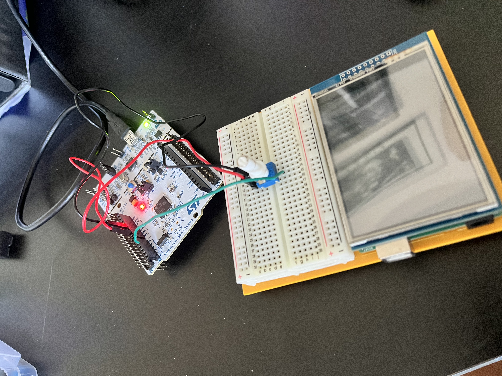

# STM32 ADC Potentiometer Reader (UART Output)

This project demonstrates reading an analog signal from a potentiometer using the STM32 ADC and transmitting the converted value over UART for real-time monitoring. The goal is to build a solid understanding of ADC fundamentals on STM32 at a low level.

---

## Project Overview

- Reads analog voltage from a potentiometer using the ADC
- Converts the signal into a digital value
- Sends ADC data over UART to a serial terminal
- Continuously updates in real time

This project was written independently to reinforce ADC and UART fundamentals.

---

## Hardware Used

- STM32 Nucleo board (STM32F4 family)
- Potentiometer
- Breadboard
- Jumper wires
- USB cable (power + UART via ST-LINK)

---

## Wiring

| Potentiometer Pin | STM32 Connection |
|-------------------|------------------|
| VCC               | 3.3V             |
| GND               | GND              |
| Wiper (middle)    | ADC input pin (e.g., PA0) |

⚠️ **Important:** STM32 ADC pins are not 5V tolerant.

---

## Software Structure

- `main.c`  
  Initializes peripherals and runs the main loop

- `adc.c / adc.h`  
  ADC configuration and analog-to-digital conversion logic

- `uart.c / uart.h`  
  UART initialization and serial output functions

- `syscalls.c / sysmem.c`  
  Required for `printf` support

---

## Program Flow

1. Initialize system clock
2. Initialize UART
3. Initialize ADC
4. Main loop:
   - Read ADC value
   - Transmit value over UART
   - Optional delay

---

## Example UART Output

---

## How to Run

1. Open the project in **STM32CubeIDE**
2. Build and flash the firmware
3. Open a serial terminal:
   - Baud rate: 115200
   - Data bits: 8
   - Stop bits: 1
   - Parity: None
4. Rotate the potentiometer and observe the output

---

## Why This Project Matters

This project reinforces:
- ADC resolution and scaling
- Voltage-to-digital conversion
- UART-based debugging
- Low-level embedded reasoning

This is a foundational embedded systems exercise done **without step-by-step tutorial guidance**.

---

## Author

Jahmai Cabrera  
Computer Science Student | Embedded & Firmware Systems

